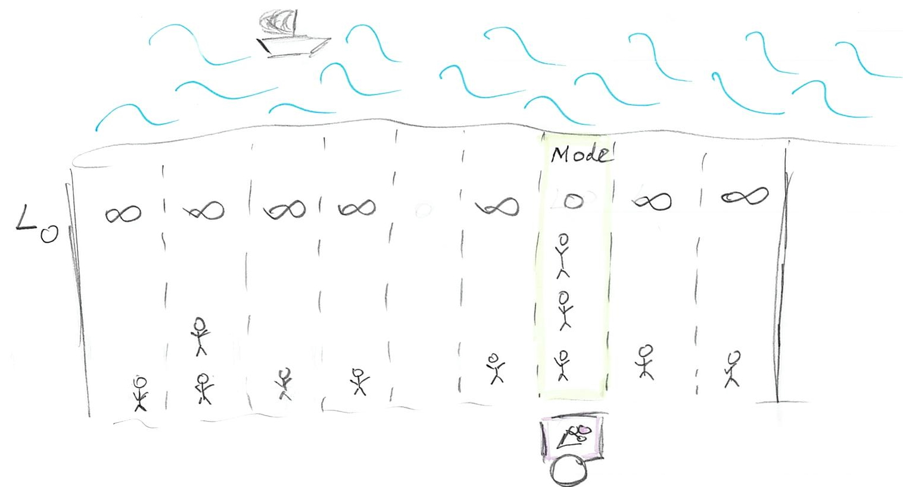
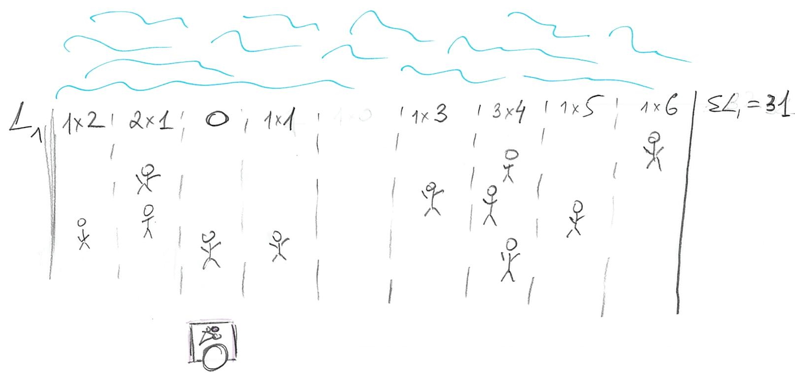
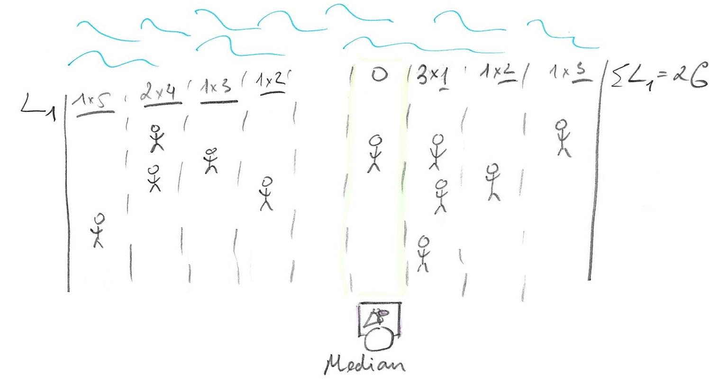

# Loss functions

The purpose of this comment is to give you an intuition about loss functions, mentioned in chapter 3. In particular, I want you to understand why different loss functions (L0, L1, and L2) correspond to different point-estimates (mode, median, and mean). Plus, I want you to understand that you can view a choice of a likelihood function, as in picking Gaussian in chapter 4, as being analogous to picking a loss function.

I am afraid that the easiest way to explain why an _L2_ loss results in _mean_ is a via derivative. So, if you are not confident in your basic calculus skill, it might be useful for you to first watch a few episodes of [Essense of Calculus](https://www.youtube.com/playlist?list=PLZHQObOWTQDMsr9K-rj53DwVRMYO3t5Yr) series by Grant Sanderson, a.k.a. [3Blue1Brown](https://www.3blue1brown.com/). I would suggest watching at least the first three episodes (actually, I would recommend to watch the whole series) but if you are short on time watch only episode 2^[Although, if you skip episode 1, you won't know why it is _obvious_ that area of a circle is $\pi\cdot r^2$].

## Loss function, the concept
Imagine that you are selling ice-cream on a beach, so we can assume it is a narrow strip of sand and, therefore, a one-dimensional problem. It is hot, so _everyone_ wants ice-cream (obviously) and you want to maximize the number of ice-creams you sell (obviously). People are distributed in some random (not necessarily uniform or symmetric) way along the beach, so the question is: Where do you put your _single_ ice-cream stand to maximize your profits? The answer depends on your choice of the _loss function_ that describes how distance between a particular person and your stand influences whether person will buy your ice-cream. In other words, it describes the  _cost_ of getting to you stand, i.e. walking all-the-way through the sand in that heat. This _cost_ clearly depends on the distance and in the simplest case, it is linearly proportional to the distance: If you need to walk twice the distance, your costs for getting an ice-cream are twice as high. However, the relationship between the distance and cost does not have to be so simple and linear and this is why we have many different _loss_ / _cost_ functions.

We can  write a loss/cost function more formally as $L(stand, person_i)$ where `stand` is the location of your stand and `person_i` is a location of a particular i<sup>th</sup> person. The cost can be either zero or positive, i.e., we assume there is no benefit in walking all the way, only no or some cost. So, where should you put you ice-cream stand?

```{r echo=FALSE, out.width = "100%", fig.align = 'center'}
knitr::include_graphics("images/loss-functions-where-to.jpg")
```

## L0 (mode)
The simplest loss function is  
$$L0(stand, person_i) =  \begin{cases}
0, stand == person_i \\
\infty, stand \neq person_i
\end{cases}$$

This function assumes that everybody hates walking so much, that _any_ walk is unbearable and should be avoided. Thus, there is no cost for getting your ice-cream only for people who are positioned right next to your stand. For everybody else, even one meter away, the costs of walking are infinite, so they won't bother and, therefore, won't buy your ice-cream. Still, we are in the business of selling one, so where do we put our stand given how lazy our customers are? Well, we just find the biggest group of people and put our stand next to them. No one else will come but at least you got the biggest group of customers you could. If you look at the _distribution_ of your customers along the beach this is the highest peak (that you peak) and it is called the _mode_ of the distribution.

```{r echo=FALSE, out.width = "100%", fig.align = 'center'}

```

## L1 (median)
The next loss function, that I already mention, assumes a simple linear relationship between the distance and the cost
$$L1(stand, person_i) = |person_i - stand|$$
In other words, the cost is equal to distance (we need `| |` to get an absolute value, because the person could be "to the left of" of stand, in which case `person - stand` distance will be negative). So, where should we put our stand? Let us start at a fairly random location so that 3 of our customers are on the left and 7 are on the right. 
```{r echo=FALSE, out.width = "100%", fig.align = 'center'}

```

We can, in principle, compute the actual cost but it is simpler to ask the question of whether we can _improve_ on that cost by moving somewhere else? Imagine that we move to the left where _minority_ of our customers are. Now we have 1 on the left and 8 on the right (plus 2 more at our location).
```{r echo=FALSE, out.width = "100%", fig.align = 'center'}
knitr::include_graphics("images/loss-functions-L1-left.jpg")
```

The problem is, we moved _away_ from the majority of the people so our total cost is *original cost - 3 (improvement due to moving close to minority) + 8 (increase in loss due to moving away from majority)*, so $\Delta L1 = +5$. Oops, we made it worse! How about moving to the _right_? 
```{r echo=FALSE, out.width = "100%", fig.align = 'center'}
knitr::include_graphics("images/loss-functions-L1-right.jpg")
```
Now that we move _towards_ the majority of customers, we have four on the left and six on the right (plus one at our location). The change in cost is *original cost + 4 (loss due to moving away from minority) - 6 (improvement due to moving towards majority)*, so $\Delta L1 = -2$. Which gives us an idea: we should try to get even closer to that majority by keeping walking to the right! Eventually, you will get to point of the 50/50. Should you keep moving to the right? Should you move to the left? Should you move at all?

```{r echo=FALSE, out.width = "100%", fig.align = 'center'}

```

There is no point in moving to the left. You just came from where because moving to the right made things better. However, if you keep moving to the right, you will keep passing people, so that majority now will be on the left and you would be walking _away_ from the majority, raising the costs (and your loses). So, once you get to point where half of your customers are on the left and half are on the right, you cannot do any better. Any movement that gets you from 50/50 means there are more customers on one side (say left, if you moved to the right) and, as we already figured out, your best strategy is to move towards the majority, which gets you back where you started at 50/50 point. That 50/50 points split, when half of customers / probability mass is on one side and half is on the other, is called _median_.

## L2 (mean)
The classic loss function is Euclidean distance $$L2(stand, person_i) = (person - stand)^2$$
Here, every next step becomes progressively harder for our customers. The cost of walking 1 meter is 1 (unit of effort). But walking 2 is $2^2 = 4$ and is $3^2=9$ for 3 meters. Thus, the penalty (cost/loss) for being further away from your stand increases as a power law. Still, one needs to sell ice-cream, so one needs to find the best spot where total cost is minimal 

$$L2(stand, person) = \sum_{i=1}^{N}{(person_i - stand)^2}$$
```{r echo=FALSE, out.width = "100%", fig.align = 'center'}
knitr::include_graphics("images/loss-functions-L2-mean.jpg")
```


Or, we can compute the minimal _average_ cost by dividing the sum by the total number of customers `N`:
$$<L2(stand, person)> = \frac{1}{N}\sum_{i=1}^{N}{(person_i - stand)^2}$$

Conceptually, you find that minimum by walking along the beach in the direction that reduces the cost until you hit the point where it start going up again. This strategy is called _gradient descent_ and, generally speaking, this is how computer finds minima computationally: They make steps in a different directions to see which way is down and keep going until things start going up. However, in one-dimensional well-behaving case we have here things are even simpler as you can use calculus to figure out the solution analytically. If you watched the videos I advertised above, you'll know that the _derivative_ of the function is zero at the extrema (minima or maxima), so we just need to differentiate our average _L2_ over position of the stand and find where it is zero^[I've nicked the derivations from [https://stats.stackexchange.com/a/312997]].

$$\frac{\partial L2}{\partial stand} = -\frac{2}{N}\sum_{i=1}^{N}{(person_i - stand)}$$
As we want $\frac{\partial L2}{\partial stand} = 0$, we state
$$-\frac{2}{N}\sum_{i=1}^{N}{(person_i - stand)} = 0$$. 
Opening up brackets and rearranging we get
$$-\frac{2}{N}\sum_{i=1}^{N}{person_i} + \frac{2\cdot N}{N}\cdot stand = 0\\
2\cdot stand = \frac{2}{N}\sum_{i=1}^{N}{person_i} \\
stand = \frac{1}{N}\sum_{i=1}^{N}{person_i}
$$

So, the optimal location of your stand is the _mean_: an average location of all people on the beach.


## L1 (median) vs. L2 (mean)
One problem about the _mean_ is that it is sensitive to outliers. Because the costs grow as a power law, this approach favors a lot of medium-sized distances over lots of smalls ones plus one really large one. Thus, a single person at a far side of the beach would have a big influence on your stand's location (you already saw the difference in the example above). In data analysis, this means that those outliers will pull your estimates away from the majority of responses. Which is why it might be a good idea to consider using `median` rather than `mean`. If you distribution is symmetric, the difference will be negligible but in presence of outliers `median`, as a point-estimate, is more robust.

## Choosing a likelihood
So far we talked about selling ice-cream on the beach but same question of choosing your loss function applies when you are trying to fit a distribution or a regression line, as in chapter 4. Here, you also have a point-estimate (regression line at each point) and you try to put it in such a way as to minimize the costs of having data points off that line (the distance from the point-estimate of the line and each data point is call a _residual_). The classic way is to use _L2_ distance and the approach is called _ordinary least squares_, as you try to minimize squared residuals.

Alternatively, you can express same costs-of-being-off-the-line using a distribution, such as Gaussian. You put its peak (mean) at the (candidate) location of your point estimate (that point has highest probability, so lowest cost) and the loss is computed as a probability of the residual (distance-to-the-point). You can think about it in terms of the probability that a person will go and buy ice-cream from your stand.
```{r echo=FALSE, out.width = "100%", fig.align = 'center'}
knitr::include_graphics("images/loss-functions-Gaussian.jpg")
```

The Gaussian is special because it uses L2 distance, see $(x - \mu)^2$ inside the exponential:
$$f(x) = \frac{1}{\sigma \sqrt(2 \pi)}\left(-\frac{1}{2}\frac{(x - \mu)^2}{\sigma^2}\right)$$

so using it is equivalent to fitting via ordinary least squares. However, as McElreath hinted, you can choose different priors that are different not only in the distance-to-loss formula (like _L1_ is different from _L2_) but also in symmetry. Both _L1_ and _L2_ (and Gaussian) ignore the sign of the distance. It does not matter whether customers are on the left or on the right. Other distributions, such as Beta, Gamma, or Log Normal are not symmetric, so the same distance will cost differently depending on the side the customer is at.
```{r echo=FALSE, out.width = "100%", fig.align = 'center'}
knitr::include_graphics("images/loss-functions-Gamma.jpg")
```

This allows you to think about the choice of your likelihood distribution in terms of choosing a loss function: Should it be symmetric? Should it operate only within certain range (1..7 for a Likert scale, 0..1 for proportions, positive values for Gamma)?  Should it weight all points equally? As you saw in the examples above, picking a different function moves your cart (regression line), so you should keep in mind that using a different likelihood will move the regression line and produce different estimates and predictions. Good news: You will learn about your options in the book, so you will have an idea about how to pick them.

## Gaussian in frenquentist versus Bayesian statistics
Later on in the book McElreath will note that erroneously assuming normal distribution for residuals ruins your inferences in frequentist statistics but not in Bayesian. This is because of parametric nature of inferences in frequentist statistics. By assuming that residuals are normal, you can approximate significance by using t- or F-distribution with appropriate degrees of freedom. However, if your initial assumption is wrong, your inferences will be based on idealized not real residuals. If you residuals tend to be asymmetric, as in any proportion data, the numbers you see are about _symmetric_ residuals with the observed variance, not your real _asymmetric_ residuals. Numbers will be off and it won't be easy (although probably possible) to say by how much. In contrast, Bayesian statistics does not use approximations and builds the posterior distribution directly. Thus it treats Gaussian (or any other distribution) as a loss function and the asymmetry or abnormality of residuals is less critical (merely not optimal).


